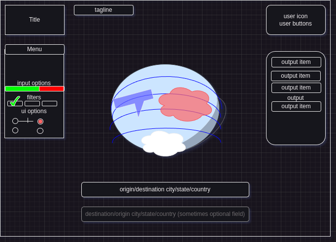

Welcome to Traveluxe (name pending review), your visual guide to flight data trends.

Dynamic software developers Malcolm Caleb and William Davis have created an interactive world map
that allows a user to see and feel, with a dynamic 3D interactive heatmap, where people are going, where
people are leaving, where is cheap to fly, and where is expensive. Find out which countries don't book flights 
to which others, and what happens to travel after a disaster or during the olympics. Enormous volumes of raw data
come together into a coherent idea of who is going where and when. 

Welcome to Traveluxe (name pending review), and thank you for using our service!

Development roadmap:

-start from nothing, build website.
-> profit

Organizing wireframe:

Tech Stack:
Frontend: React with Redux
Backend: Flask